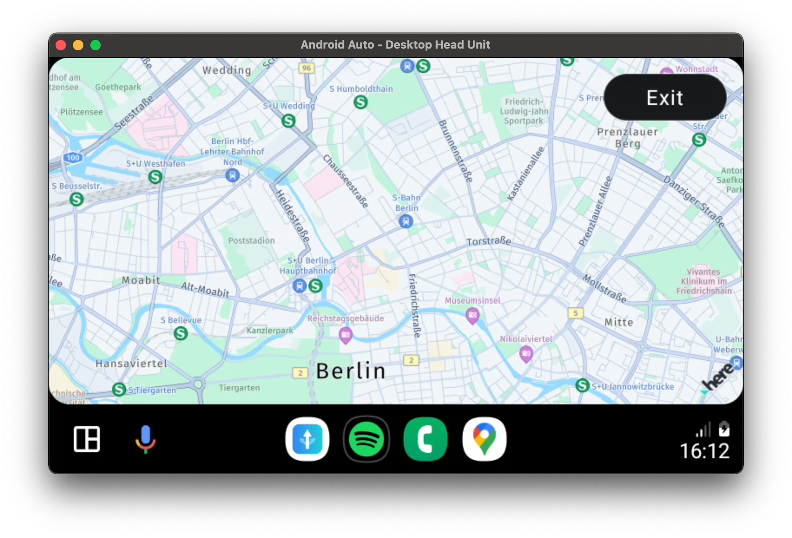
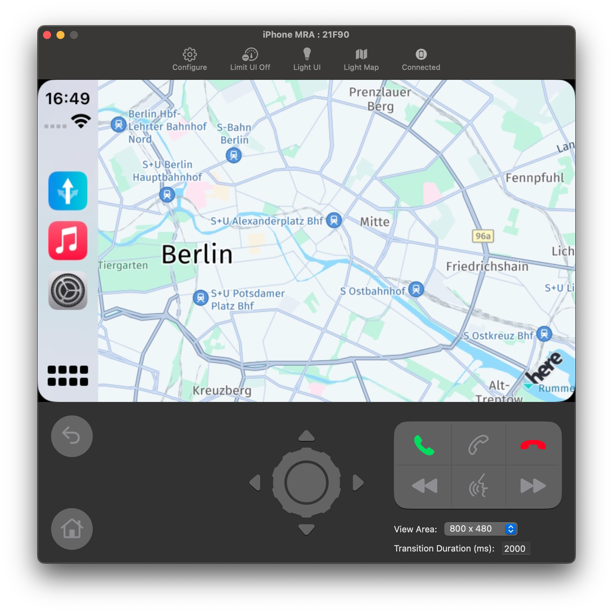
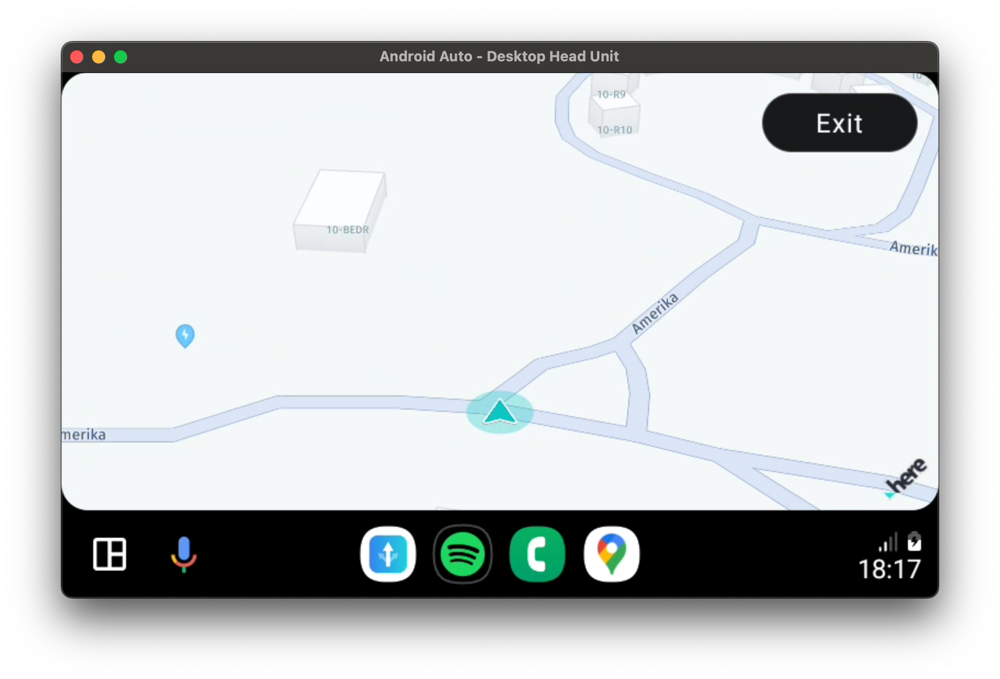
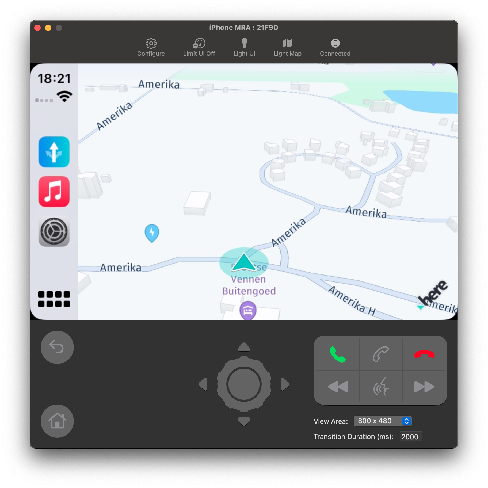
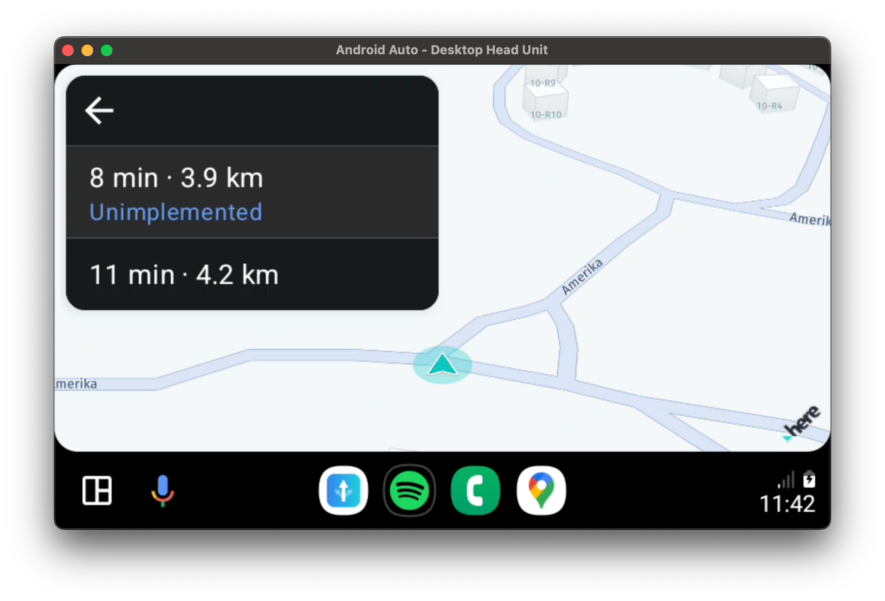
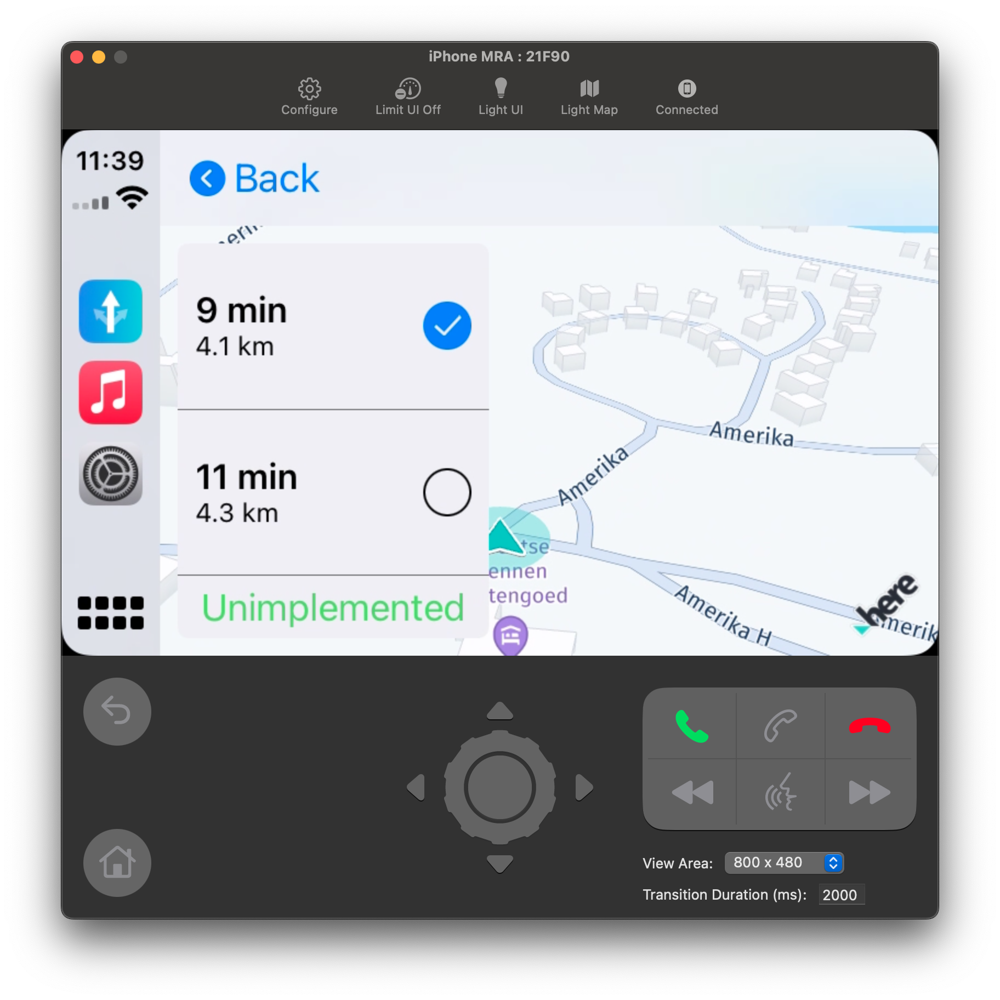

# Using the Flutter HERE SDK with Android Auto & Apple CarPlay

1. [Introduction](#introduction)  
2. [Preparing the Flutter project](#preparing-the-flutter-project)  
    a. [Android Auto - Android (Kotlin)](#android-auto---android-kotlin)  
    b. [Apple CarPlay - iOS (Swift)](#apple-carplay---ios-swift)  
    c. [Flutter (Dart)](#flutter-dart)  
3. [Implementing a routing screen](#implementing-a-routing-screen)  
    a. [Flutter (Dart)](#flutter-dart-1)  
    b. [Android Auto - Android (Kotlin)](#android-auto---android-kotlin-1)  
    c. [Apple CarPlay - iOS (Swift)](#apple-carplay---ios-swift-1)  
4. [Conclusion](#conclusion)  
5. [Notes](#notes)  
6. [Useful links](#useful-links)  

## Introduction

The HERE Flutter SDK makes it easy to implement a fully fledged navigation app for smartphones. However, an increasing number of people are looking for integrations with their car in the form of either Android Auto or Apple CarPlay.    
This subject hasn't been broadly documented yet, so in this article we'll explore how you could go about integrating Android Auto and Apple CarPlay into your Flutter app.

As our starting point we're using the [HERE SDK reference application for Flutter](https://github.com/heremaps/here-sdk-ref-app-flutter). We'll show you, step-by-step, the changes needed to integrate with Android Auto or Apple CarPlay and finish the article by implementing some basic features.

Hopefully at the end of this article you'll have a solid understanding regarding how to integrate Android Auto or Apple CarPlay into you're personal projects.

The final codebase can be found [here](https://github.com/JvSomeren/here-sdk-ref-app-flutter).

## Preparing the Flutter project

If you're following along go ahead and download the [HERE SDK reference application for Flutter](https://github.com/heremaps/here-sdk-ref-app-flutter). Make sure to follow [the steps](https://github.com/heremaps/here-sdk-ref-app-flutter?tab=readme-ov-file#get-started) listed in the README in order to be able to build the app.

When making changes related to either Android or iOS it might be preferable to use Android Studio of XCode respectively. Especially for iOS, XCode takes care of assigning newly created files to your project.  
We'll refer to the non-Flutter code we're gonna be writing as "platform code". You can recognize is whenever it is in either Kotlin for Android or Swift for iOS.

With that sorted let's dive into it!

### Android Auto - Android (Kotlin)

If you've looked around in the [HERE documentation](https://www.here.com/docs/) you might have found the HERE SDK for Android [documentation regarding Android Auto](https://www.here.com/docs/bundle/sdk-for-android-navigate-developer-guide/page/topics/android-auto.html#integrate-android-auto). It does a good job listing the steps needed to let us open our application in Android Auto and show a map.  
Since we are using Flutter there are some minor changes we need to make to the steps listed. All these steps will be mentioned below and are changed, where relevant, to meet our purposes.  
The largest difference you might notice is that we'll be using Kotlin instead of Java, this is merely a matter of preference.

Now, before we delve into any code we need a way to actually test what we're about to implement! For this we need the Desktop Head Unit (DHU). The HERE documentation does a good job explaining how to install this piece of software, so please follow the steps as written [here](https://www.here.com/docs/bundle/sdk-for-android-navigate-developer-guide/page/topics/android-auto.html#set-up-the-desktop-head-unit-dhu).  
Additional information from the official Android documentation can be found [here](https://developer.android.com/training/cars/testing/dhu).

With that out of the way it is finally time to look at some code! Once again, a lot of what you're about to read is the same as what is written in the HERE Android SDK documentation. However! There are some crucial changes due to integrating Android Auto with Flutter. If you follow the steps as mentioned below you shouldn't run into any problems. Let's begin!

Make sure the `minSdkVersion` Version is set to 23 or higher in the app's `android/app/build.gradle` file as Android Auto is only supported on Android 6.0 or higher:
```
minSdkVersion 23
```

In the same file, integrate Android Auto in the dependencies closure as well as the HERE SDK:
```gradle
dependencies {
    ...

    // Android Auto
    implementation "androidx.car.app:app:1.2.0-rc01"
    compileOnly fileTree(dir: '../../plugins/here_sdk/android/libs', include: ['*.aar'])
}
```

In the `AndroidManifest.xml` file (`android/app/src/main/AndroidManifest.xml`), add the following required permissions:
```xml
<!-- Declare Android Auto specific permissions. -->
<uses-permission android:name="androidx.car.app.ACCESS_SURFACE"/>
<uses-permission android:name="androidx.car.app.NAVIGATION_TEMPLATES"/>
```

In the same file, add the following to the `<application>` tag:
```xml
<!-- Declare the CarAppService for use with Android Auto. -->
<service
    android:name=".HelloMapCarAppService"
    android:exported="true">
    <intent-filter>
        <action android:name="androidx.car.app.CarAppService"/>
        <category android:name="androidx.car.app.category.NAVIGATION"/>
    </intent-filter>
</service>

<!-- Declare the Android Auto API Level and layout template. -->
<meta-data
    android:name="androidx.car.app.minCarApiLevel"
    android:value="1"/>
<meta-data
    android:name="com.google.android.gms.car.application"
    android:resource="@xml/automotive_app_desc"
    tools:ignore="MetadataTagInsideApplicationTag"/>
```
We will create the `HelloMapCarAppService` class below - as well as the required `automotive_app_desc.xml` template. For our example, this file has only this content:
```xml
<?xml version="1.0" encoding="utf-8"?>

<automotiveApp>
    <uses name="template" />
</automotiveApp>
```
Create a new "xml" directory and add the file: `android/app/src/main/res/xml/automotive_app_desc.xml`.

Now create the `HelloMapCarAppService` Kotlin class / file (place it in the same directory as your `MainApplication.kt`):
```kotlin
package com.example.RefApp

import android.annotation.SuppressLint
import android.content.Intent
import android.content.pm.ApplicationInfo
import androidx.car.app.CarAppService
import androidx.car.app.Screen
import androidx.car.app.Session
import androidx.car.app.validation.HostValidator

/**
 * Entry point for the hello map app.
 *
 * <p>{@link CarAppService} is the main interface between the app and the car host. For more
 * details, see the <a href="https://developer.android.com/training/cars/apps">Android for
 * Cars Library developer guide</a>.
 */
class HelloMapCarAppService: CarAppService() {
    @SuppressLint("PrivateResource")
    override fun createHostValidator(): HostValidator {
        return if ((applicationInfo.flags and ApplicationInfo.FLAG_DEBUGGABLE) != 0) {
            HostValidator.ALLOW_ALL_HOSTS_VALIDATOR
        } else {
            HostValidator.Builder(applicationContext)
                .addAllowedHosts(androidx.car.app.R.array.hosts_allowlist_sample)
                .build()
        }
    }

    override fun onCreateSession(): Session {
        return object : Session() {
            override fun onCreateScreen(intent: Intent): Screen {
                return HelloMapScreen(carContext)
            }
        }
    }
}
```

Finally, in order to show a map once we start Android Auto, we're going to create the `HelloMapScreen` class / file. Create it in the same directory as the `HelloMapCarAppService` and with the following content:
```kotlin
package com.example.RefApp

import androidx.car.app.AppManager
import androidx.car.app.CarContext
import androidx.car.app.Screen
import androidx.car.app.SurfaceCallback
import androidx.car.app.SurfaceContainer
import androidx.car.app.model.Action
import androidx.car.app.model.ActionStrip
import androidx.car.app.model.Template
import androidx.car.app.navigation.model.NavigationTemplate
import com.here.sdk.core.GeoCoordinates
import com.here.sdk.mapview.MapMeasure
import com.here.sdk.mapview.MapScheme
import com.here.sdk.mapview.MapSurface

class HelloMapScreen(carContext: CarContext) : Screen(carContext), SurfaceCallback {
    private val mapSurface: MapSurface

    init {
        carContext.getCarService(AppManager::class.java).setSurfaceCallback(this)
        // The MapSurface works the same as the HereMapController we know from Flutter. It uses
        // a surface in order to draw the map to the screen.
        mapSurface = MapSurface()
    }

    override fun onGetTemplate(): Template {
        // Add a button to exit the app.
        val actionStripBuilder = ActionStrip.Builder()
        actionStripBuilder.addAction(
            Action.Builder()
                .setTitle("Exit")
                .setOnClickListener(this::exit)
                .build()
        )

        val builder = NavigationTemplate.Builder()
        builder.setActionStrip(actionStripBuilder.build())

        return builder.build()
    }

    override fun onSurfaceAvailable(surfaceContainer: SurfaceContainer) {
        mapSurface.setSurface(
            carContext,
            surfaceContainer.surface,
            surfaceContainer.width,
            surfaceContainer.height
        )

        mapSurface.mapScene.loadScene(MapScheme.NORMAL_DAY) { mapError ->
            if (mapError == null) {
                val distanceInMeters = 1000.0 * 10
                val mapMeasureZoom = MapMeasure(MapMeasure.Kind.DISTANCE, distanceInMeters)
                mapSurface.camera.lookAt(GeoCoordinates(52.530932, 13.384915), mapMeasureZoom)
            }
        }
    }

    override fun onSurfaceDestroyed(surfaceContainer: SurfaceContainer) {
        mapSurface.destroySurface()
    }

    private fun exit() {
        carContext.finishCarApp()
    }
}
```
This is the most interesting part of our integration with Android Auto. Since we declared our app as service to support Android Auto in our `AndroidManifest.xml`, it will automatically show the `HelloMapScreen` on a DHU launched in Android Auto.

In order to render content, an app needs to render to a `Surface`. For this, every Android Auto screen implements the `SurfaceCallback` to get notified when the surface is available. For convenience, the HERE SDK provides a `MapSurface` class that accepts a `SurfaceContainer` as parameter:
```kotlin
mapSurface.setSurface(
            carContext,
            surfaceContainer.surface,
            surfaceContainer.width,
            surfaceContainer.height
        )
```

If you've followed all the steps you should see a map in the DHU!



### Apple CarPlay - iOS (Swift)

Just as for the Android Auto integration, the HERE SDK for iOS [documentation regarding Apple CarPlay](https://www.here.com/docs/bundle/sdk-for-ios-navigate-developer-guide/page/topics/carplay.html) does a good job explaining of how to implement Apple CarPlay. However, as was the case with our Android Auto integration, there are some important differences with regards to Flutter. And once again all the required steps are mentioned below.

First off we need to make sure we can actually build our application. Start XCode and open the **Runner** target. Under **General** we need to change the minimum deployment target to `13.0`. Then head on over to **Signing & Capabilities**, change the "Team" and "Bundle Identifier" to something you are able to build for.

Create a new Property List file with the name `Entitlements.plist`. This file should be located in the `ios/Runner` directory. Edit it to contain the following:
```xml
<?xml version="1.0" encoding="UTF-8"?>
<!DOCTYPE plist PUBLIC "-//Apple//DTD PLIST 1.0//EN" "http://www.apple.com/DTDs/PropertyList-1.0.dtd">
<plist version="1.0">
<dict>
	<key>com.apple.developer.carplay-maps</key>
	<true/>
</dict>
</plist>
```
The `com.apple.developer.carplay-maps` key indicates an application scope that is needed for turn-by-turn navigation apps. In order for our application to make use of these entitlements we need to apply it. Once again open the **Runner** target and select **Build Settings**. On This page you should find **Code Signing Entitlements** set its path to `Runner/Entitlements.plist`.

Now add the following to your `Info.plist` to enable the CarPlay scene configuration. Note that for the HERE Reference app you should do this in both the `Info-Debug.plist` and `Info-Release.plist`:
```xml
<!-- Scene configuration -->
<key>UIApplicationSceneManifest</key>
<dict>
    <key>UIApplicationSupportsMultipleScenes</key>
    <true/>
    <key>UISceneConfigurations</key>
    <dict>
        <!-- iPhone and iPad Scene Configuration -->
        <key>UIWindowSceneSessionRoleApplication</key>
        <array>
            <dict>
                <key>UISceneClassName</key>
                <string>UIWindowScene</string>
                <key>UISceneDelegateClassName</key>
                <string>$(PRODUCT_MODULE_NAME).iPhoneSceneDelegate</string>
                <key>UISceneConfigurationName</key>
                <string>Default Configuration</string>
            </dict>
        </array>
        <!-- CarPlay Scene Configuration -->
        <key>CPTemplateApplicationSceneSessionRoleApplication</key>
        <array>
            <dict>
                <key>UISceneClassName</key>
                <string>CPTemplateApplicationScene</string>
                <key>UISceneDelegateClassName</key>
                <string>$(PRODUCT_MODULE_NAME).CarPlaySceneDelegate</string>
                <key>UISceneConfigurationName</key>
                <string>Default CarPlay Configuration</string>
            </dict>
        </array>
    </dict>
</dict>
```

Then we need to create our `CarPlaySceneDelegate` and make it conform to the `CPTemplateApplicationSceneDelegate` protocol to manage the lifecycle events for the CarPlay scenes. `CPTemplateApplicationSceneDelegate` is responsible for setting up the user interface in CarPlay and handling the transitions between different states of the application when used in a CarPlay environment. This class is specified in the `Info.plist` under the `CPTemplateApplicationSceneSessionRoleApplication` key and gets called when the app interacts with CarPlay.

`CPTemplateApplicationSceneDelegate` requires us to implement two methods. The first one notifies when the mobile device is connected to the head unit's display - and thus, we receive a CarPlay window to show content. The second one notifies, when the device is disconnected. The `CPTemplateApplicationSceneDelegate` allows us to receive a `CPWindow` for which we set our `CarPlayViewController` instance as `rootViewController`. This will be the base view to manage the content shown in our CarPlay window.

Below is the implementation of `CarPlaySceneDelegate`:
```swift
import CarPlay

// `CarPlaySceneDelegate` manages the lifecycle events for the CarPlay scenes.
class CarPlaySceneDelegate: UIResponder, CPTemplateApplicationSceneDelegate {
    var interfaceController: CPInterfaceController?
    var carPlayWindow: CPWindow?
    let carPlayMapTemplate = CPMapTemplate()
    let carPlayViewController = CarPlayViewController()

    /// Conform to `CPTemplateApplicationSceneDelegate`, needed for CarPlay.
    /// Called when the CarPlay interface controller connects and a new window for CarPlay is created.
    /// Initializes the view controller for CarPlay and sets up the root template with necessary UI elements.
    func templateApplicationScene(_ templateApplicationScene: CPTemplateApplicationScene,
                                  didConnect interfaceController: CPInterfaceController,
                                  to window: CPWindow) {
        self.interfaceController = interfaceController
        self.carPlayWindow = window

        // CarPlay window has been connected. Set up the view controller for it and a map template.
        interfaceController.setRootTemplate(carPlayMapTemplate, animated: true)
        // CarPlayViewController is main view controller for the provided CPWindow.
        window.rootViewController = carPlayViewController
    }

    /// Conform to `CPTemplateApplicationSceneDelegate`, needed for CarPlay.
    /// Called when the CarPlay interface is disconnected.
    /// Use this method to clean up resources related to the CarPlay interface.
    func templateApplicationScene(_ templateApplicationScene: CPTemplateApplicationScene,
                                  didDisconnect interfaceController: CPInterfaceController,
                                  from window: CPWindow) {
        // Handle disconnection from CarPlay.
    }
}
```

Normally Flutter automatically handles our scenes for us and we don't have to bother with any of that. However, now that we've defined our own Scene configuration in the `Info.plist` we need to do it ourselves. For that we need to make the following changes.

The first change is to `AppDelegate.swift`. Replace the existing method with the code shown below:
```swift
override func application(
    _ application: UIApplication,
    didFinishLaunchingWithOptions launchOptions: [UIApplication.LaunchOptionsKey: Any]?
  ) -> Bool {
    UNUserNotificationCenter.current().delegate = self as UNUserNotificationCenterDelegate
    
    return true
}
```

Our second change is that we need to create our `iPhoneSceneDelegate` as we defined in our `Info.plist`. Create a new file called `iPhoneSceneDelegate.swift` in the same directory as the `AppDelegate.swift`. Add the following code:
```swift
// `iPhoneSceneDelegate` manages the lifecycle events of a UI scene for the application.
class iPhoneSceneDelegate: UIResponder, UIWindowSceneDelegate {

    var window: UIWindow?

    /// Called when a new scene session is being created and associated with the app.
    /// This method sets up the initial content and configuration for the scene using Storyboards.
    func scene(_ scene: UIScene, willConnectTo session: UISceneSession, options connectionOptions: UIScene.ConnectionOptions) {
        guard let windowScene = scene as? UIWindowScene else { return }

        window = UIWindow(windowScene: windowScene)
        
        // Manually create a FlutterEngine and FlutterViewController.
        let flutterEngine = FlutterEngine(name: "SceneDelegateEngine")
        flutterEngine.run()
        GeneratedPluginRegistrant.register(with: flutterEngine)
        let controller = FlutterViewController.init(engine: flutterEngine, nibName: nil, bundle: nil)
        window?.rootViewController = controller
        window?.makeKeyAndVisible()
    }
}
```
Now our Flutter app will again work as expected.

Finally we need to create a `UIViewController` to show a map when our app is used in CarPlay. This controller is called from our `CarPlaySceneDelegate`. In the same directory as the `AppDelegate.swift` create a new file `CarPlayViewController.swift` and add the following:
```swift
import heresdk
import UIKit

// This is the view controller shown on the car's head unit display with CarPlay.
class CarPlayViewController: UIViewController {

    var mapView : MapView!

    override func viewDidLoad() {
        super.viewDidLoad()

        // Initialize MapView without a storyboard.
        mapView = MapView(frame: view.bounds)
        view.addSubview(mapView)

        // Load the map scene using a map scheme to render the map with.
        mapView.mapScene.loadScene(mapScheme: MapScheme.normalDay, completion: onLoadScene)
    }

    // Completion handler when loading a map scene.
    private func onLoadScene(mapError: MapError?) {
        guard mapError == nil else {
            print("Error: Map scene not loaded, \(String(describing: mapError))")
            return
        }

        // Configure the map.
        let camera = mapView.camera
        let distanceInMeters = MapMeasure(kind: .distance, value: 1000 * 7)
        camera.lookAt(point: GeoCoordinates(latitude: 52.518043, longitude: 13.405991), zoom: distanceInMeters)
    }

    override func didReceiveMemoryWarning() {
        super.didReceiveMemoryWarning()
        mapView.handleLowMemory()
    }
}
```

And that should be it for iOS! To test if it works you can use the [CarPlay Simulator](https://developer.apple.com/documentation/carplay/using-the-carplay-simulator). You should be greeted with a map upon opening the app in the CarPlay Simulator.



Read on to learn about integrating everything we've done so far with Flutter!

## Flutter (Dart)

With everything related to Android Auto and Apple CarPlay completed we're finally ready to start on our integration with Flutter!  
It should be mentioned that Flutter doesn't provide direct support for Android Auto and Apple CarPlay. However by combining the tools the HERE SDK provides us and some platform code we can implement everything we could want. The [HERE documentation](https://www.here.com/docs/bundle/sdk-for-flutter-navigate-developer-guide/page/topics/android-auto.html) gives us a good overview of how we could go about integrating with Flutter. In this article we're going to take things one step further so please follow what's written below.

Communication between Flutter code and platform code is done using [MethodChannels](https://api.flutter.dev/flutter/services/MethodChannel-class.html). We're going to use the [`pigeon`](https://pub.dev/packages/pigeon) package for this. It uses `MethodChannels` under the hood but formalizes the calls to make it type-safe and easier to use. Install `pigeon` as a dev dependency:
```
flutter pub add --dev pigeon
```

After installing `pigeon`, create a new file in a new directory called `pigeons/car.dart`. This will be our `pigeon` definition file. We're going to leave it quite empty for now but don't worry, we'll come back to it later:
```dart
import 'package:pigeon/pigeon.dart';

// Configure where our generated pigeon code should end up.
@ConfigurePigeon(PigeonOptions(
    input: 'pigeons/car.dart',
    // Flutter
    dartOut: 'lib/pigeons/car.pg.dart',
    // Android
    kotlinOut: 'android/app/src/main/kotlin/com/example/RefApp/Car.pg.kt',
    kotlinOptions: KotlinOptions(package: 'com.example.RefApp'),
    // iOS
    swiftOut: 'ios/Runner/Car.pg.swift',
))

// Declare an API to call from our platform code into our Flutter code.
@FlutterApi()
abstract class CarToFlutterApi {
    void setupMapView();
}
```
If you're not following along adapt the `kotlinOut` and `kotlinOptions` according to your own app.

For us to be able to use what we've just written we need to generate the final code. This is a easy as running this command:
```
dart run pigeon --input pigeons/car.dart
```
This should have generated a Dart, Kotlin and Swift file based on our definition file. With regards to iOS be sure to add the generated file to your XCode project. Using XCode, right-click the **Runner** directory and select **Add Files to "Runner"...**.

To make use of our newly generated code we have to make a few changes to our platform code. Let's start with iOS.

The generated `CarToFlutterApi` needs access to our `FlutterEngine`, otherwise we won't be able to call into Flutter. To accomplish this we're exposing it on the `iPhoneSceneDelegate`:
```swift
class iPhoneSceneDelegate: UIResponder, UIWindowSceneDelegate {

    // add this line
    static private(set) var flutterEngine: FlutterEngine? = nil

    var window: UIWindow?

    func scene(_ scene: UIScene, willConnectTo session: UISceneSession, options connectionOptions: UIScene.ConnectionOptions) {

        ...

        // add this line
        iPhoneSceneDelegate.flutterEngine = flutterEngine
    }
}
```

Next up, we're giving the `CarPlayViewController` a big overhaul. It will no longer be responsible for managing our map. Instead we're delegating this task to the Flutter part of our codebase. Let's see how:
```swift
import heresdk
// add this line
import here_sdk
import UIKit

class CarPlayViewController: UIViewController {

    var mapView : MapView!
    var mapViewHost : MapViewHost!

    override func viewDidLoad() {
        super.viewDidLoad()

        mapView = MapView(frame: view.bounds)
        view.addSubview(mapView)
        
        // replace `mapView.mapScene.loadScene(...)` with the code below
        if let flutterEngine = iPhoneSceneDelegate.flutterEngine {
            mapViewHost = MapViewHost(
                viewIdentifier: 123,
                binaryMessenger: flutterEngine.binaryMessenger,
                mapView: mapView
            )
            
            CarToFlutterApi(binaryMessenger: flutterEngine.binaryMessenger).setupMapView { _ in }
        }
    }

    // remove the `onLoadScene` method

    override func didReceiveMemoryWarning() {
        super.didReceiveMemoryWarning()
        mapView.handleLowMemory()
    }
}
```
The `MapViewHost` is what will allow us to control the map instance from our Flutter code. And `CarToFlutterApi(...).setupMapView` calls into our Flutter code to let it know that it should prepare our map.

We will make comparable changes to our Android code. For the `HelloMapScreen` do the following:
```kotlin
...
// add these 2 lines
import com.here.sdk.mapview.MapSurfaceHost
import io.flutter.embedding.engine.FlutterEngineCache

class HelloMapScreen(carContext: CarContext) : Screen(carContext), SurfaceCallback {
    private val mapSurface: MapSurface
    // add these 2 lines
    private val mapSurfaceHost: MapSurfaceHost?
    private val carToFlutterApi: CarToFlutterApi?

    init {
        carContext.getCarService(AppManager::class.java).setSurfaceCallback(this)
        mapSurface = MapSurface()

        // add the code below
        val binaryMessenger = FlutterEngineCache.getInstance()
            .get(MainActivity.FLUTTER_ENGINE_ID)
            ?.dartExecutor
            ?.binaryMessenger
        
        mapSurfaceHost = binaryMessenger?.let { MapSurfaceHost(123, it, mapSurface) }
        carToFlutterApi = binaryMessenger?.let { CarToFlutterApi(it) }
    }
    
    ...

    override fun onSurfaceAvailable(surfaceContainer: SurfaceContainer) {
        mapSurface.setSurface(
            carContext,
            surfaceContainer.surface,
            surfaceContainer.width,
            surfaceContainer.height
        )

        // replace `mapSurface.mapScene.loadScene` with the line below
        carToFlutterApi?.setupMapView { }
    }

    ...

}
```
In the code above `MapSurfaceHost` fulfills the same purpose as `MapViewHost` did for iOS.

That should be it for the platform code. Now we need a way to handle the calls that are being made into our Flutter code.  
In our `pigeon` file we defined the abstract class `CarToFlutterApi`. And then we used the generated code within our platform code. For Flutter we need to implement it ourself, since `CarToFlutterApi` is generated as an abstract class. This implementation will receive and handle all the calls made from the platform code into our Flutter code.

Lets begin by implementing `CarToFlutterApi`. Create a new file at `lib/car/car_to_flutter.dart`, this is going to be our implementation:
```dart
import 'dart:async';

import 'package:here_sdk/core.dart';
import 'package:here_sdk/mapview.dart';
import 'package:here_sdk/navigation.dart';

import '../pigeons/car.pg.dart';
import '../positioning/positioning.dart';
import '../positioning/positioning_engine.dart';

class CarToFlutter extends CarToFlutterApi {
    late final PositioningEngine _positioningEngine;
    StreamSubscription<Location>? _locationUpdatesSubscription;

    CarToFlutter(PositioningEngine positioningEngine) {
        // Register this class instance to receive calls from the platform code.
        CarToFlutterApi.setUp(this);
        _positioningEngine = positioningEngine;
    }

    void dispose() {
        // On disposal we de-register handling of calls.
        CarToFlutterApi.setUp(null);
        _locationUpdatesSubscription?.cancel();
    }

    @override
    void setupMapView() async {
        // Notice that we use the same 'id' as we defined in our platform code.
        final mapController = HereMapController(123);

        final isInitialized = await mapController.initialize((_) {});
        if (!isInitialized) throw 'Failed to initialize HereMapController';

        // Here we load the given MapScheme for the map running on
        // our Android Auto / Apple CarPlay screen.
        mapController.mapScene.loadSceneForMapScheme(MapScheme.normalDay, (error) {
            if (error != null) {
                throw 'Failed loading scene: $error';
            }
            
            // This VisualNavigator will be applied to the Android Auto / Apple CarPlay map.
            final visualNavigator = VisualNavigator()..startRendering(mapController);

            final lastKnownLocation = _positioningEngine.lastKnownLocation;
            if (lastKnownLocation != null) {
                mapController.camera.lookAtPointWithMeasure(
                    lastKnownLocation.coordinates,
                    MapMeasure(MapMeasureKind.distance, Positioning.initDistanceToEarth),
                );

                visualNavigator.onLocationUpdated(lastKnownLocation);
            }
            _locationUpdatesSubscription =
                _positioningEngine.getLocationUpdates.listen((event) {
                    visualNavigator.onLocationUpdated(event);
                });
        });
    }
}
```
The code within the `setupMapView()`-method should be quite familiar to anyone who has used the `HereMap` widget before. This is because after initializing the `HereMapController` this instance will pretty much function the same as if it were a map within our Flutter widget tree. No need to write additional platform code in order to, for example, draw a `MapMarker`. That is the beauty of this implementation.

But just implementing `CarToFlutterApi` won't get us there yet. We need to make sure that our newly create class is active within our app. In our case this is as simple as adding a new provider. In our `lib/main.dart` file:
```dart
...
import 'package:here_sdk_reference_application_flutter/environment.dart';
import 'package:provider/provider.dart';

// add this line
import 'car/car_to_flutter.dart';
import 'common/application_preferences.dart';
import 'common/custom_map_style_settings.dart';
...

class _MyAppState extends State<MyApp> {

    ...

    @override
    Widget build(BuildContext context) {
        return MultiProvider(
            providers: [
                ...
                // add this provider
                Provider(
                    lazy: false,
                    create: (context) {
                        final positioningEngine =
                            Provider.of<PositioningEngine>(context, listen: false);

                        return CarToFlutter(positioningEngine);
                    },
                    dispose: (context, value) => value.dispose(),
                ),
            ],

            ...
        );
    }
}
```
By defining this provider as `lazy` we ensure that it gets initialized with the rest of our app.

And that should be it! It's finally time to test if everything we've done actually works. For iOS you can use the 'CarPlay Simulator' to test your CarPlay integration. For Android you should use the DHU.  
You should be greeted by a map on your Android Auto / Apple CarPlay screen. Initialized and controllable from our Flutter code.





In the next section we're taking things one step further and show you some examples of how to implement actual Android Auto / Apple CarPlay features.

## Implementing a routing screen

If you've followed the article so far you should be greeted with a view of a map when running your application in Android Auto / Apple CarPlay. We're going to expand on this in the form of a routing screen, lucky for us this already exists in the reference app.  
Implementing such a feature should give you an understanding of how you could implement interactions with Android Auto / Apple CarPlay from Flutter code and the other way around.  
To keep the scope of this article reasonable we're implementing the following features. Updating the list of available routes shown to the users, update the selected route and a way to stop routing. The interactions performed on the phone will be reflected on the Android Auto / Apple CarPlay screen and vice versa.
Let's get started!

### Flutter (Dart)

First off we're going to define all the necessary methods and classes in the `pigeon` definition file (`pigeons/car.dart`) we created earlier:
```dart
...

class PgRouteOption {
    final int hashCode;

    final int lengthInMeters;

    final int durationInSeconds;

    final String distanceString;

    final String durationString;

    const PgRouteOption({
        required this.hashCode,
        required this.lengthInMeters,
        required this.durationInSeconds,
        required this.distanceString,
        required this.durationString,
    });
}

class PgLatLng {
    final double latitude;
    final double longitude;

    const PgLatLng(this.latitude, this.longitude);
}

class PgRouteOptionsUpdatedMessage {
    final PgLatLng origin;
    final PgLatLng destination;
    final List<PgRouteOption?> routeOptions;

    const PgRouteOptionsUpdatedMessage({
        required this.origin,
        required this.destination,
        required this.routeOptions,
    });
}

@FlutterApi()
abstract class CarToFlutterApi {
    void setupMapView();

    void updateSelectedRouteOption(int routeOptionIndex);

    void stopRouting();

    void onDisconnect();
}

@HostApi()
abstract class FlutterToCarApi {
    void onStartRouting();

    void onRouteOptionsUpdated(PgRouteOptionsUpdatedMessage message);

    void onRouteOptionSelected(int routeOptionIndex);

    void onStopRouting();
}
```
As you can see we've defined some new methods in the `CarToFlutterApi` class we created earlier. These methods will be used to interact with the routing state from within the platform code. We also defined a new class `FlutterToCarApi`, as the name suggests this will be used to interact with our platform code from the Flutter part of our application.
Besides the two "API" classes we've also added a few other classes. These simply serve as a way for us to pass structured data between our platform code and Flutter.

With the changes to our `pigeon` definitions we need to regenerate the resulting code. As we've done before run the following command:
```
dart run pigeon --input pigeons/car.dart
```

Now that the `pigeon` code has been generated you will see some errors within your project. Let's resolve that!

Calls to a class defined as either `@HostApi()` or `@FlutterApi()` are always expected to be handled, when not - an exception is thrown. This is why we make sure these kinds of classes are always active.  
We want to handle calls to the methods of these classes in different part of our codebase. To make this easier we're going to be implementing an observer pattern for both our platform code and Flutter code.

In our `lib/car/car_to_flutter.dart` add the following code:
```dart
...

abstract interface class CarRoutingListener {
    void stopRouting();
    void updateSelectedRouteOption(int routeOptionIndex);
}

class CarToFlutter extends CarToFlutterApi {

    ...

    final Set<CarRoutingListener> _carRoutingListeners = {};

    void addRoutingListener(CarRoutingListener listener) {
        _carRoutingListeners.add(listener);
    }

    void removeRoutingListener(CarRoutingListener listener) {
        _carRoutingListeners.remove(listener);
    }

    @override
    void stopRouting() {
        for (final listener in _carRoutingListeners) {
            listener.stopRouting();
        }
    }

    @override
    void updateSelectedRouteOption(int routeOptionIndex) {
        for (final listener in _carRoutingListeners) {
            listener.updateSelectedRouteOption(routeOptionIndex);
        }
    }

    @override
    void onDisconnect() {
        _locationUpdatesSubscription?.cancel();
    }
}
```
The implementations of the `stopRouting` and `updateSelectedRouteOption` method are propagating to any registered listener. Thus the `CarRoutingListener` class is what we need to implement wherever we'd be interested in handling these given methods. In our case that would be the `RoutingScreen` over at `lib/routing/routing_screen.dart`:
```dart

...

class _RoutingScreenState extends State<RoutingScreen>
        with TickerProviderStateMixin, Positioning
        // add this line
        implements CarRoutingListener {
    
    ...

    late CarToFlutter _carToFlutterApi;

    @override
    void initState() {

        ...

        WidgetsBinding.instance.addPostFrameCallback((_) {
            if (!context.mounted) return;

            _carToFlutterApi =
                Provider.of<CarToFlutter>(context, listen: false);
            _carToFlutterApi.addRoutingListener(this);
        });
    }

    @override
    void dispose() {
        _carToFlutterApi.removeRoutingListener(this);

        ...

    }

    ...

    @override
    void stopRouting() {
        Navigator.of(context).pop();
    }

    @override
    void updateSelectedRouteOption(int routeOptionIndex) {
        _routesTabController.animateTo(routeOptionIndex);
    }
}
```
As you can see in the `RoutingScreen` we're acting upon calls to `stopRouting` and `updateSelectedRouteOption` and are updating the UI on the phone accordingly.

However this only works in one direction. Any interactions on the phone aren't reflected in our Android Auto / Apple CarPlay screen. For that to happen we need to make changes to the `LandingScreen` as well as the `RoutingScreen`:
```dart
//lib/landing_screen.dart
...

class _LandingScreenState extends State<LandingScreen>
        with Positioning, WidgetsBindingObserver {
    ...

    void _showRoutingScreen(WayPointInfo destination) async {
        final GeoCoordinates currentPosition = lastKnownLocation != null
            ? lastKnownLocation!.coordinates
            : Positioning.initPosition;

        FlutterToCarApi().onStartRouting();

        ...
    }
}

..
```

```dart
// lib/routing/routing_screen.dart
...

class _RoutingScreenState extends State<RoutingScreen>
        with TickerProviderStateMixin, Positioning
        implements CarRoutingListener {
    ...

    _updateSelectedRoute() {
        ...

        FlutterToCarApi().onRouteOptionSelected(_selectedRouteIndex);
    }

    ...
    
    Widget _buildBottomNavigationBar(context) {
        ...

            IconButton(
                icon: Icon(Icons.close),
                color: colorScheme.primary,
                onPressed: () {
                    // add this line
                    FlutterToCarApi().onStopRouting();
                    Navigator.of(context).pop();
                },
            ),

        ...
    }
    
    ...

    _onRoutingEnd(Routing.RoutingError? error, List<Routing.Route>? routes) {
        // add the 2 lines below
        final origin = _wayPointsController.first;
        final destination = _wayPointsController.last;

        if (routes == null || routes.isEmpty) {
            if (error != null) {
                ...
            }

            // add the following line
            FlutterToCarApi().onRouteOptionsUpdated(PgRouteOptionsUpdatedMessage(
                origin: origin.coordinates.toPgLatLng(),
                destination: destination.coordinates.toPgLatLng(),
                routeOptions: [],
            ));

            return;
        }

        ...

        _routesTabController.addListener(() => _updateSelectedRoute());

        // add the following line
        FlutterToCarApi().onRouteOptionsUpdated(PgRouteOptionsUpdatedMessage(
            origin: origin.coordinates.toPgLatLng(),
            destination: destination.coordinates.toPgLatLng(),
            routeOptions: routes.map((e) => e.toPgRouteOption(context)).toList(),
        ));

        _addRoutesToMap();

        ...
    }
}
```
Where we needed a reference to the `binaryMessenger` in our platform code we don't need such a thing within our Flutter code. There the `ServicesBinding.defaultBinaryMessenger` will be used.  

In the code written above we make use of some extensions and helper functions which don't exists yet. Let us resolve this to finalize the Flutter part of the implementation!

Create a new file called `pigeon_extensions.dart` in `lib/common/extensions`:
```dart
import 'package:flutter/material.dart' show BuildContext;
import 'package:here_sdk/core.dart';
import 'package:here_sdk/routing.dart';

import '../../pigeons/car.pg.dart';
import '../util.dart' as Util;

extension RoutePigeonUtil on Route {
    PgRouteOption toPgRouteOption(BuildContext context) => PgRouteOption(
                hashCode: hashCode,
                lengthInMeters: lengthInMeters,
                durationInSeconds: duration.inSeconds,
                distanceString: Util.makeDistanceString(context, lengthInMeters),
                durationString: Util.makeDurationString(context, duration.inSeconds),
            );
}

extension GeoCoordinatesPigeonUtil on GeoCoordinates {
    PgLatLng toPgLatLng() => PgLatLng(latitude: latitude, longitude: longitude);
}
```

Remove the `_buildDurationString` from `lib/routing/route_info_widget.dart` and move it over to `lib/common/util.dart`:
```dart
// lib/routing/route_info_widget.dart

...

class RouteInfo extends StatelessWidget {

    ...

    @override
    Widget build(BuildContext context) {
        ...

            TextSpan(
                // replace `_buildDurationString(...)` with `Util.makeDurationString(...)`
                text: Util.makeDurationString(
                    context, route.duration.inSeconds) + " ",
                ...
                children: [
                    if (route.trafficDelay.inSeconds > Duration.secondsPerMinute)
                        TextSpan(
                          text: Util.formatString(
                                AppLocalizations.of(context)!.trafficDelayText, [
                                    // replace `_buildDurationString(...)` with `Util.makeDurationString(...)`
                                    Util.makeDurationString(context, route.trafficDelay.inSeconds)
                                ]),

                            ...
                        ),
                    ...
                ],
            ),

        ...
    }

    ...

    // remove this whole method
    String _buildDurationString(BuildContext context, int durationInSeconds) {
        ...
    }
}

```

```dart
// lib/common/util.dart

...

String makeDurationString(BuildContext context, int durationInSeconds) {
    int minutes = (durationInSeconds / 60).truncate();
    int hours = (minutes / 60).truncate();
    minutes = minutes % 60;

    if (hours == 0) {
        return "$minutes ${AppLocalizations.of(context)!.minuteAbbreviationText}";
    } else {
        String result =
            "$hours ${AppLocalizations.of(context)!.hourAbbreviationText}";
        if (minutes != 0) {
            result +=
                " $minutes ${AppLocalizations.of(context)!.minuteAbbreviationText}";
        }
        return result;
    }
}

...
```

Add a `first` and `last` getter to the `WayPointsController` in `lib/routing/waypoints_controller.dart`.
```dart
...

class WayPointsController extends ValueNotifier<List<WayPointInfo>> {
    ...

    /// Return the first waypoint in the waypoints list.
    WayPointInfo get first => super.value.first;

    /// Return the last waypoint in the waypoints list.
    WayPointInfo get last => super.value.last;

    ...
}
```

And with that the Flutter side of our implementation is completed! Let's handle Android Auto next.

### Android Auto - Android (Kotlin)

Just as we implemented `CarToFlutterApi` in our Flutter code we need to implement the `FlutterToCarApi` in our platform code. We're also using the same observer pattern again. Create a new file called `FlutterToCar.kt` in the same directory as your `MainActivity.kt` with the following content:
```kotlin
package com.example.RefApp

class FlutterToCar private constructor() : FlutterToCarApi {
    companion object {
        val instance = FlutterToCar()
    }

    // generic observer

    private var genericObservers: Set<GenericObserver> = setOf()

    fun addObserver(observer: GenericObserver) {
        genericObservers = genericObservers.plus(observer)
    }

    fun removeObserver(observer: GenericObserver) {
        genericObservers = genericObservers.minus(observer)
    }

    // routing observer

    private var routingObservers: Set<RoutingObserver> =
        setOf()

    fun addObserver(observer: RoutingObserver) {
        routingObservers = routingObservers.plus(observer)
    }

    fun removeObserver(observer: RoutingObserver) {
        routingObservers = routingObservers.minus(observer)
    }

    interface GenericObserver {
        fun onStartRouting()
    }

    override fun onStartRouting() {
        for (observer in genericObservers) {
            observer.onStartRouting()
        }
    }

    interface RoutingObserver {
        fun onRouteOptionsUpdated(message: PgRouteOptionsUpdatedMessage) {}

        fun onRouteOptionSelected(routeOptionId: Long) {}

        fun onStopRouting() {}
    }

    override fun onRouteOptionsUpdated(message: PgRouteOptionsUpdatedMessage) {
        for (observer in routingObservers) {
            observer.onRouteOptionsUpdated(message)
        }
    }

    override fun onRouteOptionSelected(routeOptionIndex: Long) {
        for (observer in routingObservers) {
            observer.onRouteOptionSelected(routeOptionIndex)
        }
    }

    override fun onStopRouting() {
        for (observer in routingObservers) {
            observer.onStopRouting()
        }
    }
}
```
This class will serve as an entrypoint for all calls made to `FlutterToCarApi` from our Flutter code.  
And just as for our Flutter code we need to ensure this new class initializes whenever our application launches. We do this in the `MainApplication`:
```kotlin
...

class MainApplication : Application() {
    override fun onCreate() {
        ...

        FlutterToCarApi.setUp(flutterEngine.dartExecutor.binaryMessenger, FlutterToCar.instance)
    }

    override fun onTerminate() {
        FlutterEngineCache.getInstance()
            .get(MainActivity.FLUTTER_ENGINE_ID)
            ?.dartExecutor
            ?.binaryMessenger
            ?.let { binaryMessenger ->
                FlutterToCarApi.setUp(binaryMessenger, null)
            }

        FlutterEngineCache.getInstance().remove(MainActivity.FLUTTER_ENGINE_ID)

        super.onTerminate()
    }
}
```

The only thing that remains is implementing the observers we created earlier and adding calls to `CarToFlutterApi` methods in the right places.
For our `HelloMapScreen` this is pretty straight forward. We need to handle calls from `FlutterToCarApi.onStartRouting` and call into `CarToFlutterApi.onDisconnect`:
```kotlin
...
// add these lines
import androidx.lifecycle.DefaultLifecycleObserver
import androidx.lifecycle.LifecycleOwner
...

class HelloMapScreen(carContext: CarContext) : Screen(carContext), SurfaceCallback,
    // add this line
    DefaultLifecycleObserver, FlutterToCar.GenericObserver {
    ...

    init {
        ...

        lifecycle.addObserver(this)
        FlutterToCar.instance.addObserver(this)
    }

    override fun onDestroy(owner: LifecycleOwner) {
        FlutterToCar.instance.removeObserver(this)

        carToFlutterApi?.onDisconnect { }
    }

    ...

    /**
     * [FlutterToCar.GenericObserver] methods
     */

    /** */

    override fun onStartRouting() {
        screenManager.push(RoutingScreen(carContext))
    }
}
```

For everything related to the routing we're going to implement a `RoutingScreen`, we already mentioned it in our `HelloMapScreen.onStartRouting` implementation. Create a new file `RoutingScreen.kt` in the same directory as the `HelloMapScreen.kt`. Add to it the following code:
```kotlin
package com.example.RefApp

import android.text.SpannableString
import android.text.Spanned.SPAN_INCLUSIVE_EXCLUSIVE
import androidx.car.app.CarContext
import androidx.car.app.Screen
import androidx.car.app.model.Action
import androidx.car.app.model.Distance
import androidx.car.app.model.DistanceSpan
import androidx.car.app.model.DurationSpan
import androidx.car.app.model.ItemList
import androidx.car.app.model.Row
import androidx.car.app.model.Template
import androidx.car.app.navigation.model.RoutePreviewNavigationTemplate
import androidx.lifecycle.DefaultLifecycleObserver
import androidx.lifecycle.LifecycleOwner
import io.flutter.embedding.engine.FlutterEngineCache

class RoutingScreen(carContext: CarContext) : Screen(carContext), DefaultLifecycleObserver,
    FlutterToCar.RoutingObserver {

    private var routeOptions: List<PgRouteOption>? = null
    private var selectedRouteOptionIndex: Int = 0

    private val carToFlutterApi: CarToFlutterApi?

    init {
        lifecycle.addObserver(this)
        FlutterToCar.instance.addObserver(this)

        carToFlutterApi = FlutterEngineCache.getInstance()
            .get(MainActivity.FLUTTER_ENGINE_ID)
            ?.dartExecutor
            ?.binaryMessenger
            ?.let { binaryMessenger ->
                CarToFlutterApi(binaryMessenger)
            }
    }

    override fun onDestroy(owner: LifecycleOwner) {
        FlutterToCar.instance.removeObserver(this)

        carToFlutterApi?.stopRouting { }
    }

    override fun onGetTemplate(): Template {
        val builder = RoutePreviewNavigationTemplate.Builder().setHeaderAction(Action.BACK)

        if (routeOptions == null) {
            builder.setLoading(true)
        } else {
            val itemListBuilder = ItemList.Builder()

            if (routeOptions!!.isEmpty()) {
                itemListBuilder.setNoItemsMessage("No routes found.")
            } else {
                itemListBuilder.setOnSelectedListener(this::onRouteSelected)

                for (routeOption in routeOptions!!) {
                    val rowBuilder =
                        Row.Builder().setTitle(createTitleSpan(routeOption))

                    itemListBuilder.addItem(rowBuilder.build())
                }

                itemListBuilder.setSelectedIndex(selectedRouteOptionIndex)
            }
            builder.setItemList(itemListBuilder.build())
        }

        val navigateAction = Action.Builder()
            .setTitle("Unimplemented")
            .build()
        builder.setNavigateAction(navigateAction)

        return builder.build()
    }

    private fun onRouteSelected(selectedIndex: Int) {
        carToFlutterApi?.updateSelectedRouteOption(selectedIndex.toLong()) {}
    }

    private fun createDistance(lengthInMeters: Long): Distance {
        return if (lengthInMeters < 1000) {
            Distance.create(lengthInMeters.toDouble(), Distance.UNIT_METERS)
        } else if (lengthInMeters < 10_000) {
            Distance.create(
                lengthInMeters.toDouble() / 1000.0,
                Distance.UNIT_KILOMETERS_P1
            )
        } else {
            Distance.create(
                lengthInMeters.toDouble() / 1000.0,
                Distance.UNIT_KILOMETERS
            )
        }
    }

    private fun createTitleSpan(routeOption: PgRouteOption): SpannableString {
        val distanceSpan =
            DistanceSpan.create(createDistance(routeOption.lengthInMeters))
        val durationSpan = DurationSpan.create(routeOption.durationInSeconds)

        val titleSpan = SpannableString("  \u00b7  ")
        titleSpan.setSpan(
            durationSpan,
            0,
            1,
            SPAN_INCLUSIVE_EXCLUSIVE
        )
        titleSpan.setSpan(
            distanceSpan,
            4,
            5,
            SPAN_INCLUSIVE_EXCLUSIVE
        )

        return titleSpan
    }

    /**
     * [FlutterToCar.RoutingObserver] methods
     */

    /** */
    override fun onRouteOptionsUpdated(message: PgRouteOptionsUpdatedMessage) {
        this.routeOptions = message.routeOptions.filterNotNull()
        selectedRouteOptionIndex = 0

        invalidate()
    }

    override fun onRouteOptionSelected(routeOptionId: Long) {
        selectedRouteOptionIndex = routeOptionId.toInt()

        invalidate()
    }

    override fun onStopRouting() {
        finish()
    }
}
```
The `onGetTemplate`-method is where we construct the UI of the routing interface shown on the Android Auto screen. The rest of the methods either help with constructing this UI or update is accordingly.  
With the `RoutingScreen` completed we are done with the Android part of our implementation.

Try routing to a destination on your phone while Android Auto is connected. You should see the Android Auto UI update to reflect the new state on the phone.  
Selecting a different route or exiting the routing screen should also be reflected from whatever device you did your interaction.

Let's move on to the final implementation for iOS.

### Apple CarPlay - iOS (Swift)

As you'll see the implementation for iOS is comparable to the ones we made for Flutter and Android.

We'll start by, once again, implementing the `FlutterToCarApi`. Create a new file `FlutterToCar.swift` under `ios/Runner`:
```swift
protocol GenericDelegate: AnyObject {
    func onStartRouting()
}

protocol RoutingDelegate: AnyObject {
    func onRouteOptionsUpdated(message: PgRouteOptionsUpdatedMessage)
    func onRouteOptionSelected(routeOptionIndex: Int64)
    func onStopRouting()
}

private struct WeakGenericDelegate {
    weak var value: GenericDelegate?
    
    init(_ value: GenericDelegate) {
        self.value = value
    }
}

private struct WeakRoutingDelegate {
    weak var value: RoutingDelegate?
    
    init(_ value: RoutingDelegate) {
        self.value = value
    }
}

class FlutterToCar: FlutterToCarApi {
    private init() {}
    
    static let shared = FlutterToCar()
    
    // MARK: delegate methods
    
    private var genericDelegates: Array<WeakGenericDelegate> = Array()
    
    func addDelegate(delegate: GenericDelegate) {
        genericDelegates.append(WeakGenericDelegate(delegate))
        
        // reap disposed delegates
        genericDelegates.removeAll { $0.value == nil }
    }
    
    func removeDelegate(delegate: GenericDelegate) {
        if let index = genericDelegates.firstIndex(where: { $0.value === delegate}) {
            genericDelegates.remove(at: index)
        }
    }
    
    private var routingDelegates: Array<WeakRoutingDelegate> = Array()
    
    func addDelegate(delegate: RoutingDelegate) {
        routingDelegates.append(WeakRoutingDelegate(delegate))
        
        // reap disposed delegates
        routingDelegates.removeAll { $0.value == nil }
    }
    
    func removeDelegate(delegate: RoutingDelegate) {
        if let index = routingDelegates.firstIndex(where: { $0.value === delegate}) {
            routingDelegates.remove(at: index)
        }
    }
    
    // MARK: FlutterToCarApi methods
    
    func onStartRouting() throws {
        for delegate in genericDelegates {
            delegate.value?.onStartRouting()
        }
    }
    
    func onRouteOptionsUpdated(message: PgRouteOptionsUpdatedMessage) throws {
        for delegate in routingDelegates {
            delegate.value?.onRouteOptionsUpdated(message: message)
        }
    }
    
    func onRouteOptionSelected(routeOptionIndex: Int64) throws {
        for delegate in routingDelegates {
            delegate.value?.onRouteOptionSelected(routeOptionIndex: routeOptionIndex)
        }
    }
    
    func onStopRouting() throws {
        for delegate in routingDelegates {
            delegate.value?.onStopRouting()
        }
    }
}
```
Once again we're implementing the observer pattern, though it's called "Delegate" this time around. We use the `Weak...Delegate` classes to prevent memory leaks.  
To ensure calls to `FlutterToCarApi` are caught we initialize it on app boot. Update the `iPhoneSceneDelegate` as follows:
```swift
class iPhoneSceneDelegate: UIResponder, UIWindowSceneDelegate {
    ...

    func scene(_ scene: UIScene, willConnectTo session: UISceneSession, options connectionOptions: UIScene.ConnectionOptions) {
        ...

        FlutterToCarApiSetup.setUp(
            binaryMessenger: flutterEngine.binaryMessenger,
            api: FlutterToCar.shared
        )
    }
    
    func sceneDidDisconnect(_ scene: UIScene) {
        if let flutterEngine = iPhoneSceneDelegate.flutterEngine {
            FlutterToCarApiSetup.setUp(
                binaryMessenger: flutterEngine.binaryMessenger,
                api: nil
            )
            
            flutterEngine.destroyContext()
            iPhoneSceneDelegate.flutterEngine = nil
        }
    }
}
```

As our final action we need to implement the delegates/protocols we defined before. Make the following changes to the `CarPlaySceneDelegate`:
```swift
class CarPlaySceneDelegate: UIResponder, CPTemplateApplicationSceneDelegate,
        // add this line
        CPMapTemplateDelegate, GenericDelegate, RoutingDelegate {
    ...

    func templateApplicationScene(_ templateApplicationScene: CPTemplateApplicationScene,
                                  didConnect interfaceController: CPInterfaceController,
                                  to window: CPWindow) {
        self.interfaceController = interfaceController
        self.carPlayWindow = window

        // add this line
        carPlayMapTemplate.mapDelegate = self

        ...

        // add these 2 lines
        FlutterToCar.shared.addDelegate(delegate: self as GenericDelegate)
        FlutterToCar.shared.addDelegate(delegate: self as RoutingDelegate)
    }

    func templateApplicationScene(_ templateApplicationScene: CPTemplateApplicationScene,
                                  didDisconnect interfaceController: CPInterfaceController,
                                  from window: CPWindow) {
        ...
        
        // add the code below
        carPlayMapTemplate.mapDelegate = nil
        
        FlutterToCar.shared.removeDelegate(delegate: self as GenericDelegate)
        FlutterToCar.shared.removeDelegate(delegate: self as RoutingDelegate)

        if let flutterEngine = iPhoneSceneDelegate.flutterEngine {
            CarToFlutterApi(binaryMessenger: flutterEngine.binaryMessenger).onDisconnect { _ in }
        }
    }

    // add all the methods shown below

    // MARK: Helpers
    
    private func tripPreviewTextConfiguration() -> CPTripPreviewTextConfiguration {
        return CPTripPreviewTextConfiguration(
            startButtonTitle: "Unimplemented",
            additionalRoutesButtonTitle: nil,
            overviewButtonTitle: nil
        )
    }
    
    // MARK: CPMapTemplateDelegate
    
    func mapTemplate(
        _ mapTemplate: CPMapTemplate,
        selectedPreviewFor trip: CPTrip,
        using routeChoice: CPRouteChoice
    ) {
        let index = trip.routeChoices.firstIndex(of: routeChoice)
        
        if let flutterEngine = iPhoneSceneDelegate.flutterEngine {
            CarToFlutterApi(binaryMessenger: flutterEngine.binaryMessenger)
                .updateSelectedRouteOption(routeOptionIndex: Int64(index!)) { _ in }
        }
    }
    
    // MARK: GenericDelegate
    
    func onStartRouting() {
        if #available(iOS 14.0, *) {
            carPlayMapTemplate.backButton = CPBarButton(title: "Back") { [weak self] _ in
                if let flutterEngine = iPhoneSceneDelegate.flutterEngine {
                    CarToFlutterApi(binaryMessenger: flutterEngine.binaryMessenger).stopRouting { _ in }
                }
                
                self?.carPlayMapTemplate.hideTripPreviews()
                self?.carPlayMapTemplate.backButton = nil
            }
        } else {
            let button = CPBarButton(type: .text) { [weak self] _ in
                if let flutterEngine = iPhoneSceneDelegate.flutterEngine {
                    CarToFlutterApi(binaryMessenger: flutterEngine.binaryMessenger).stopRouting { _ in }
                }
                
                self?.carPlayMapTemplate.hideTripPreviews()
                self?.carPlayMapTemplate.backButton = nil
            }
            button.title = "Back"
            carPlayMapTemplate.backButton = button
        }
        
        carPlayMapTemplate.showTripPreviews([], textConfiguration: tripPreviewTextConfiguration())
    }
    
    // MARK: RoutingDelegate
    
    func onRouteOptionsUpdated(message: PgRouteOptionsUpdatedMessage) {
        let trip = CPTrip(
            origin: MKMapItem(from: message.origin),
            destination: MKMapItem(from: message.destination),
            routeChoices: message.routeOptions
                .filter { $0 != nil }
                .map({ routeOption in
                    let routeChoice = CPRouteChoice(
                        summaryVariants: [routeOption!.durationString],
                        additionalInformationVariants: [routeOption!.distanceString],
                        selectionSummaryVariants: []
                    )
                    
                    return routeChoice
                })
        )
        carPlayMapTemplate.showRouteChoicesPreview(
            for: trip,
            textConfiguration: tripPreviewTextConfiguration()
        )
    }
    
    func onRouteOptionSelected(routeOptionIndex: Int64) {
        // No API is provided to programmatically change the selected routeOption.
        // Implementing an alternative solution is out of the scope of this article.
    }
    
    func onStopRouting() {
        carPlayMapTemplate.hideTripPreviews()
        carPlayMapTemplate.backButton = nil
    }
}

// add this extension
extension MKMapItem {
    convenience init(from pgLatLng: PgLatLng) {
        self.init(
            placemark: MKPlacemark(
                coordinate: CLLocationCoordinate2D(
                    latitude: pgLatLng.latitude,
                    longitude: pgLatLng.longitude
                )
            )
        )
    }
}
```
A lot is happening in the code above so let's break it down. The first two methods take care of connecting to, and disconnecting, from Apple CarPlay.  
The method `func mapTemplate(_ mapTemplate: CPMapTemplate, selectedPreviewFor trip: CPTrip, using routeChoice: CPRouteChoice)` is part of the `CPMapTemplateDelegate` and is called when a different route option is selected on the Apple CarPlay screen. In this method we call to our Flutter code with the selected option.  
The finals methods are part of the `GenericDelegate` and `RoutingDelegate`. Any calls we receive from our Flutter code are applied to the UI of our Apple CarPlay screen.  
Finally we end with an extension of `MKMapItem` which is merely added as a convenience to clean up our code.

And that's it! You should have a rudimentary implementation of Android Auto and Apple CarPlay within a Flutter app.  

Be sure to try it out. The same as with Android, try routing to a destination on your phone while Apple CarPlay is connected.




## Conclusion

Hopefully this article has inspired you with regards to what's possible when using Flutter. Building a full integration with both Android Auto and Apple CarPlay can be a lot of work but using the HERE SDK and the `pigeon` package will make it a lot easier!

There is still a lot we haven't covered but we can only cover so much in a single article. To give you some ideas we'll briefly talk about some improvements.

For all turn-by-turn related logic instead of using a `VisualNavigator` look into using a `Navigator`. This class has all the same capabilities with regards to listeners such as `RouteProgressListener` but doesn't do any rendering. Now that you might be dealing with multiple `VisualNavigators`, due to Android Auto / Apple CarPlay, the `Navigator` can serve as a nice in between layer.

We haven't delved deep into using the `HereMapController` which updates the map on a Android Auto / Apple CarPlay screen. Since it functions the same as any other `HereMapController` there isn't much more to say about it. It can draw markers, manipulate the camera and everything else the same as normal. It will be highly dependent on your project's structure, and its wishes, how you would go about using it.  
Perhaps look into using a proxy class which `extends HereMapController` in order to apply updates to multiple maps at the same time. Again there are many ways to go about this so be sure to experiment with what best works for you.

## Notes

Besides the obvious missing features in our example project there might be some less obvious ones. Keep these in mind when working on your own projects.  
The state of Android Auto / Apple CarPlay doesn't "catch up" to the app state. I.e. when the phone is on the routing screen and Android Auto / Apple CarPlay connects it will not automatically be on the equivalent routing screen.  
This example projects assumes that the app is actively running on the phone, in the foreground, when a connection to Android Auto or Apple CarPlay is established. It is certainly possible to implement ways around this requirement, however this is far out-of-scope of this article.

During development and since releasing the Android Auto and Apple CarPlay integration for our own navigation app we've noticed some quirks. These might be insightful for developing your own integrations so we listed some below.

Some Android Auto units provide their own location data instead of using the phone's GPS. Most of the time this results in even better location data. However in certain cases each location event only contains a latitude and longitude, no heading, speed, etc. This can cause some issues with regards to the location indicator.

It is not possible to use a debug build of your Android app with any Android Auto unit. This is only possible with the DHU.  
Only builds downloaded from the Play Store work with Android Auto units. These can however be internal builds and don't have to be released to the public.

Sadly gestures don't work when combining Android Auto / Apple CarPlay and the HERE Flutter SDK. Even if the display supports touch it won't respond. (This applies to the display with Android Auto / Apple CarPlay, not the phone itself.)

## Useful links

[Apple CarPlay Programming Guide](https://developer.apple.com/carplay/documentation/CarPlay-App-Programming-Guide.pdf)

[Apple CarPlay Documentation](https://developer.apple.com/documentation/carplay)

[Android Auto Guide](https://developer.android.com/training/cars/apps/navigation)

[Android Auto API documentation](https://developer.android.com/reference/androidx/car/app/model/package-summary)

[HERE SDK reference application Flutter](https://github.com/heremaps/here-sdk-ref-app-flutter)

[HERE iOS SDK - Integration with CarPlay](https://www.here.com/docs/bundle/sdk-for-ios-navigate-developer-guide/page/topics/carplay.html)

[HERE Android SDK - Integration with Android Auto](https://www.here.com/docs/bundle/sdk-for-android-navigate-developer-guide/page/topics/android-auto.html)

[HERE Flutter SDK - Integration with CarPlay and Android Auto](https://www.here.com/docs/bundle/sdk-for-flutter-navigate-developer-guide/page/topics/android-auto.html)

[HERE SDK Examples](https://github.com/heremaps/here-sdk-examples/)
